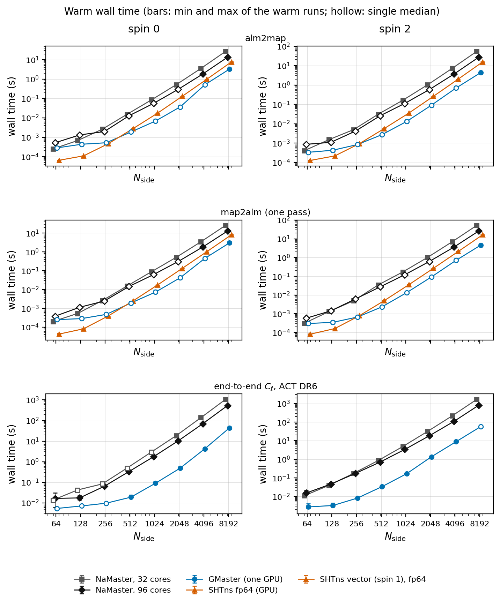

# GMaster

**Pseudo-$C_\ell$ (MASTER) power spectra on the GPU, with NaMaster's interface.**

GMaster is a GPU implementation of [NaMaster](https://github.com/LSSTDESC/NaMaster)
(Alonso, Sanchez & Slosar 2019), the standard code for angular power spectra of masked fields
of any spin: CMB temperature and polarization, weak-lensing shear, galaxy clustering. It is
written in [JAX](https://github.com/jax-ml/jax) with CUDA kernels for the spherical-harmonic
transforms and the mode-coupling matrices, and it keeps NaMaster's API:

```python
import gmaster as nmt          # instead of: import pymaster as nmt

field = nmt.NmtField(mask, [cmb_map])
bins = nmt.NmtBin.from_nside_linear(nside, 16)
workspace = nmt.NmtWorkspace.from_fields(field, field, bins)
cl = workspace.decouple_cell(nmt.compute_coupled_cell(field, field))
```

On one NVIDIA RTX PRO 6000 (96 GB), the full MASTER estimator on the ACT DR6 map runs
**12-22x faster than NaMaster on all 96 cores** of an AMD Threadripper PRO 9995WX from Nside 1024
to 8192 (7-22x from Nside 256), for both temperature and polarization. On that map the bandpowers
agree with NaMaster's to better than $10^{-4}$ up to Nside 2048 and $2.4\times10^{-4}$ at Nside 4096
(details below).



## Installation

GMaster needs Python >= 3.10, JAX with GPU support and, for the CUDA kernels, `nvcc`:

```bash
pip install "jax[cuda12]"                                    # or follow the JAX install guide
pip install "gmaster @ git+https://github.com/licongxu/GMaster.git"
```

For the tests and tutorials: `pip install "gmaster[test,examples]"` (adds NaMaster, ducc0,
matplotlib, Jupyter and CAMB). Set `JAX_ENABLE_X64=1` before JAX is imported; GMaster warns if
double precision is off.

The CUDA kernels (`gmaster/_native/`) are compiled with `nvcc` the first time they are used and
cached in `~/.cache/gmaster`. Without a CUDA GPU GMaster still runs, on the CPU through JAX, but
it is not faster than NaMaster there.

## Getting started

The [tutorials](tutorials/) are executed Jupyter notebooks that run in a few minutes on a GPU:

| notebook | what it covers |
|---|---|
| [1. Quickstart](tutorials/01_quickstart_temperature.ipynb) | a masked CMB temperature map: fields, bins, workspaces, bandpower windows |
| [2. Polarization](tutorials/02_polarization_EB.ipynb) | spin-2 fields, $TE$, $EE$, $BB$, E-to-B leakage and B-mode purification |
| [3. Simulations and covariance](tutorials/03_workspaces_simulations_covariance.ipynb) | reusing workspaces, saving them, the Gaussian covariance, a $\chi^2$ test |
| [4. Beams, noise, deprojection](tutorials/04_beams_noise_deprojection.ipynb) | beam deconvolution, cross-spectra of data splits, template deprojection and its bias |
| [5. NaMaster cross-check](tutorials/05_namaster_crosscheck_performance.ipynb) | the same estimator in both codes, timings, settings for large maps |
| [Colab demo](tutorials/colab_gmaster_vs_namaster.ipynb) | GMaster and NaMaster side by side on a free Colab or Kaggle GPU |
| [Kaggle ladder](tutorials/kaggle_nside_sweep.ipynb) | the same comparison over Nside 64-4096 on a Kaggle T4 |

[Examples](examples/) are command-line scripts: `power_spectrum_from_fits.py` computes the
spectra of your own HEALPix maps, and `act_dr6/` reproduces the real-data comparisons on the
public ACT DR6 maps.

## What is implemented

GMaster covers NaMaster 3.0's public classes and functions:

* **Fields**: curved-sky (`NmtField`, HEALPix and CAR), flat-sky (`NmtFieldFlat`) and catalog
  fields (`NmtFieldCatalog`, `...Clustering`, `...Momentum`); spin 0 and any spin; beams;
  contaminant-template deprojection; pure-E/B purification; anisotropic spin-2 masks.
* **Binning**: `NmtBin`, `NmtBinFlat` (linear, from edges, $D_\ell$ weighting, custom weights).
* **MASTER**: `NmtWorkspace` / `NmtWorkspaceFlat` for any spin pair and joint TEB, NaMaster's
  Toeplitz approximation, MASTER and FKP normalisation, coupled and decoupled spectra, bandpower
  windows, deprojection biases, `compute_full_master`, and NaMaster-compatible FITS I/O of
  workspaces.
* **Covariance**: `NmtCovarianceWorkspace` (curved and flat sky), `gaussian_covariance`, iNKA
  spectra.
* **Utilities**: `map2alm` / `alm2map` of any spin, `mask_apodization` (C1, C2, Smooth), correlated
  Gaussian simulations (`synfast_spherical`, `synfast_flat`).

Results are JAX arrays (`np.asarray(...)` converts them and waits for the GPU). Beyond NaMaster,
`gmaster.nusht` provides the general (non-uniform) spherical-harmonic transform.

## Performance and accuracy

Warm wall time of the full estimator (`NmtField` with `n_iter=3`, `NmtWorkspace`, coupled and
decoupled spectra) on the ACT DR6 f150 map and footprint mask. Each cell was run in an isolated
container: GMaster on one RTX PRO 6000 Blackwell (96 GB) with 8 host cores, NaMaster 3.0 on 32 or
all 96 cores of the same AMD Ryzen Threadripper PRO 9995WX. Medians of five warm runs; the
Nside 8192 spin-2 GMaster cell is a single warm run.

| Nside | spin | GMaster (1 GPU) | NaMaster, 32 cores | NaMaster, 96 cores | speed-up vs 96 cores |
|---:|---:|---:|---:|---:|---:|
| 256 | 0 | 0.0097 s | 0.084 s | 0.065 s | 7x |
| 1024 | 0 | 0.086 s | 3.0 s | 1.7 s | 20x |
| 2048 | 0 | 0.47 s | 18 s | 10 s | 22x |
| 4096 | 0 | 4.3 s | 137 s | 70 s | 17x |
| 8192 | 0 | 44 s | 1055 s | 530 s | 12x |
| 256 | 2 | 0.0079 s | 0.17 s | 0.18 s | 22x |
| 1024 | 2 | 0.17 s | 4.9 s | 3.4 s | 20x |
| 2048 | 2 | 1.4 s | 31 s | 18 s | 14x |
| 4096 | 2 | 8.8 s | 215 s | 110 s | 13x |
| 8192 | 2 | 57 s | 1658 s | 805 s | 14x |

**Accuracy.** On the ACT DR6 map and footprint, GMaster's bandpowers differ from NaMaster's by at
most $3\times10^{-5}$ (TT) and $4\times10^{-5}$ (EE) up to Nside 1024, $9\times10^{-5}$ at 2048 and
$2.4\times10^{-4}$ at 4096. At Nside 8192 the difference is below $10^{-3}$ for
$\ell < 2N_{\rm side}$ and reaches $7\times10^{-3}$ in the highest bandpowers. It comes from GMaster's
float32 latitudinal transforms (relative error ~$10^{-7}$), which set a floor on the tiny
high-$\ell$ power of a smooth mask; decoupling carries that into the highest bandpowers. It therefore
depends on the mask: for a Galactic cut apodized over 1 degree at Nside 1024 it is $3\times10^{-4}$
below $\ell = 2N_{\rm side}$ and $2\times10^{-3}$ at $\ell \approx 3N_{\rm side}$. HEALPix analyses are
usually restricted to $\ell \lesssim 2N_{\rm side}$ anyway. See
[docs/architecture.md](docs/architecture.md#precision).

Up to Nside 8192 the whole spin-2 estimator fits on one 96 GB GPU (peak 79 GiB); NaMaster needs
138 GiB of host memory for it.

The individual transforms (one `map2alm` pass and `alm2map`) are 1.3-3.6x faster than
[SHTns](https://bitbucket.org/nschaeff/shtns)'s float64 GPU transforms on the same card from
Nside 512 (spin 0) and 1.1-3.6x from Nside 256 (spin 2; SHTns has no spin-2 transform, so its
spin-1 vector transform is timed), and slower below that. The full board, the method and the
scripts are in [benchmarks/](benchmarks/).

These numbers are for this hardware and these operators. GMaster has not been compared with
other GPU spherical-harmonic codes (s2fft, cunuSHT) at matched accuracy.

## Documentation

* [docs/architecture.md](docs/architecture.md): package layout, transform engines, precision,
  memory policy, environment variables.
* [docs/notes/](docs/notes/): derivations of the difference-form Wigner-d march and of the
  divide-and-conquer latitudinal transform. [formal/lean/](formal/lean/) holds Lean 4 proofs of
  the identities the march relies on.
* Every public class and function has a NumPy-style docstring; NaMaster's
  [documentation](https://namaster.readthedocs.io) describes the same API.

## Tests

```bash
pip install -e ".[test]"
JAX_ENABLE_X64=1 pytest tests
```

The tests compare against NaMaster and ducc0 on the same inputs.

## References

If you use GMaster, please cite NaMaster, whose algorithms it implements:

* D. Alonso, J. Sanchez, A. Slosar, *A unified pseudo-$C_\ell$ framework*, MNRAS 484, 4127 (2019),
  [arXiv:1809.09603](https://arxiv.org/abs/1809.09603).

and, for the spherical-harmonic machinery it builds on,

* M. A. Price, J. D. McEwen, *Differentiable and accelerated spherical harmonic and Wigner
  transforms*, J. Comput. Phys. 510, 113109 (2024), [arXiv:2311.14670](https://arxiv.org/abs/2311.14670).

A paper describing GMaster is in preparation.
