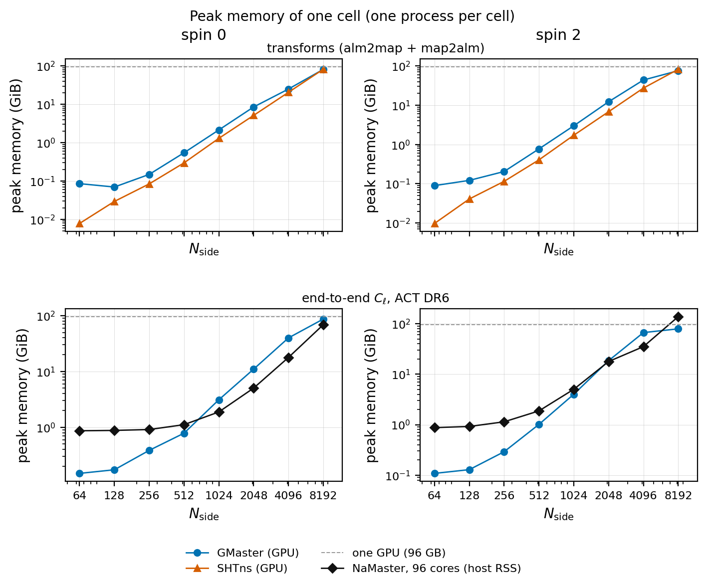

# Benchmarks

## The scaling board (`scaling/`)

Warm wall time and peak memory of GMaster, NaMaster and SHTns from Nside 64 to 8192, for spin 0
and spin 2. All numbers are in [`scaling/results.json`](scaling/results.json); the figures are
made from it by `plot_time_vs_nside.py` and `plot_memory_vs_nside.py`.


### Hardware and method

* GPU: one NVIDIA RTX PRO 6000 Blackwell Workstation Edition, 96 GB.
* CPU: AMD Ryzen Threadripper PRO 9995WX, 96 cores / 192 threads, same machine.
* Every cell is one process inside a Docker container with an exclusive cpuset (the host is
  denied those cores): GMaster with 8 cores and the GPU, NaMaster 3.0 with 32 cores (and their
  hyperthreads) or all 96 physical cores. `isolate_run.sh` and `isolate96_run.sh` set this up.
* One untimed call, then five timed warm calls (all five are recorded). Cells marked `median` in
  `results.json` come from an earlier board that kept only the median.
* Transforms: `alm2map` and one `map2alm` pass (`n_iter=0`), `lmax = 3 Nside - 1`, random inputs
  (`bench_three_way.py` for GMaster and SHTns, `bench_nm_sht.py` for NaMaster). SHTns runs on its
  own Gauss-Legendre grid in float64; it has no spin-2 transform, so its spin-1 vector transform
  is timed in the spin-2 panels.
* End to end: the ACT DR6 f150 map and its footprint mask, `NmtField(n_iter=3)`, `NmtWorkspace`,
  coupled and decoupled spectra, linear bins of 30 (`bench_act_warm.py`). GMaster runs with
  `XLA_PYTHON_CLIENT_PREALLOCATE=false` and its default routes.
* Memory: GMaster's XLA-accounted device peak, SHTns's growth of device memory in use, NaMaster's
  host peak RSS; one process per cell.

### End to end (ACT DR6), median of the warm runs

| Nside | spin | GMaster | NaMaster, 32 cores | NaMaster, 96 cores |
|---:|---:|---:|---:|---:|
| 256 | 0 | 0.0097 s | 0.084 s | 0.065 s |
| 1024 | 0 | 0.086 s | 3.0 s | 1.7 s |
| 2048 | 0 | 0.47 s | 18 s | 10 s |
| 4096 | 0 | 4.3 s | 137 s | 70 s |
| 8192 | 0 | 44 s | 1055 s | 530 s |
| 256 | 2 | 0.0079 s | 0.17 s | 0.18 s |
| 1024 | 2 | 0.17 s | 4.9 s | 3.4 s |
| 2048 | 2 | 1.4 s | 31 s | 18 s |
| 4096 | 2 | 8.8 s | 215 s | 110 s |
| 8192 | 2 | 57 s (one warm run) | 1658 s | 805 s |

GMaster's decoupled spectra agree with NaMaster's (96 cores) to between $5\times10^{-7}$
(Nside 64) and $7\times10^{-5}$ (Nside 4096) of the largest bandpower, and to $2.0\times10^{-4}$
(spin 0) and $4.0\times10^{-5}$ (spin 2) at Nside 8192 (`agreement` in `results.json`).

### Transforms, median of the warm runs

| Nside | spin | transform | GMaster | SHTns (fp64) | NaMaster, 32 cores | NaMaster, 96 cores |
|---:|---:|---|---:|---:|---:|---:|
| 1024 | 0 | alm2map | 6.9 ms | 17.5 ms | 85 ms | 56 ms |
| 1024 | 0 | map2alm | 7.3 ms | 17.5 ms | 89 ms | 62 ms |
| 1024 | 2 | alm2map | 13.1 ms | 35 ms | 162 ms | 112 ms |
| 1024 | 2 | map2alm | 13.5 ms | 35 ms | 171 ms | 121 ms |
| 4096 | 0 | alm2map | 0.51 s | 0.99 s | 3.6 s | 1.9 s |
| 4096 | 0 | map2alm | 0.45 s | 1.03 s | 3.4 s | 1.8 s |
| 4096 | 2 | alm2map | 0.70 s | 1.98 s | 7.2 s | 3.7 s |
| 4096 | 2 | map2alm | 0.71 s | 2.06 s | 6.9 s | 3.6 s |
| 8192 | 0 | alm2map | 3.3 s | 7.7 s | 27 s | 13.5 s |
| 8192 | 0 | map2alm | 3.0 s | 8.1 s | 26 s | 12.9 s |
| 8192 | 2 | alm2map | 4.4 s | 15.5 s | 54 s | 27 s |
| 8192 | 2 | map2alm | 4.6 s | 16.3 s | 52 s | 26 s |

Below Nside 256 (spin 2) and 512 (spin 0) SHTns is faster than GMaster: at those sizes the
transforms take well under a millisecond and fixed per-call overheads dominate.

### Peak memory of the end-to-end estimator

| Nside | spin | GMaster (device) | NaMaster, 96 cores (host) |
|---:|---:|---:|---:|
| 1024 | 0 / 2 | 3.1 / 4.0 GiB | 1.9 / 5.0 GiB |
| 2048 | 0 / 2 | 11.0 / 18.5 GiB | 5.0 / 17.8 GiB |
| 4096 | 0 / 2 | 39.8 / 66.6 GiB | 17.8 / 35.1 GiB |
| 8192 | 0 / 2 | 86.6 / 79.0 GiB | 68.6 / 137.6 GiB |



### Reproducing

```bash
# 1. cache the ACT DR6 maps (see examples/act_dr6/README.md)
python examples/act_dr6/prepare.py --data-dir /path/to/act_dr6.02_maps_standard --out act_cache
export ACT_CACHE=$PWD/act_cache

# 2. one cell per process, in an isolated container (BENCH_IMAGE: any image with bash)
CUDA_VISIBLE_DEVICES=0 XLA_PYTHON_CLIENT_PREALLOCATE=false OMP_NUM_THREADS=8 \
  benchmarks/scaling/isolate_run.sh 32-39,128-135 --gpus device=0 -- \
  python benchmarks/scaling/bench_act_warm.py 1024 0 gmaster 8
OMP_NUM_THREADS=96 benchmarks/scaling/isolate96_run.sh -- \
  python benchmarks/scaling/bench_act_warm.py 1024 0 namaster 96
REPS=5 GMASTER_DC=0 python benchmarks/scaling/bench_three_way.py gm 1024 0      # GMaster transforms
REPS=5 python benchmarks/scaling/bench_three_way.py shtns 1024 0                # SHTns (SHTNS_DIR)
REPS=5 python benchmarks/scaling/bench_nm_sht.py 1024 0 96                      # NaMaster transforms
```

Each script prints one `RESULT {json}` line per cell. The isolation scripts need Docker with
cgroup v2 and permission to set an exclusive cpuset; the benchmarks run without them too, only
less reproducibly.

## Other benchmarks

`benchmark_*.py` are single-process benchmarks run as modules, e.g.
`python -m benchmarks.benchmark_pipeline --help`: the full pipeline stage by stage against
NaMaster (`benchmark_pipeline`), transforms against ducc0 (`benchmark_sht`), coupling matrices
(`benchmark_curved_coupling`, `benchmark_scalar_toeplitz`), flat-sky workspaces and covariances,
memory at Nside 4096, and the general SHT against ducc0 (`benchmark_nusht`).
